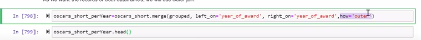

# Pandas

### Nicolas Riedel

### [Repo con ejercicios](https://github.com/RiedelNicolas/EjerciciosPandas)

## Cheat sheet

*	Siempre importar : 
	-	import *pandas* as pd
	-	import *numpy* as np
 
*	Leemos el CSV
	
	df = pd.read_csv(path, encoding='latin-1'(u otro) )

*	Si queremos levantar solo algunas columnas:  	
	df_short = pd.read_csv(path,usecols= \[nombre de col1', 'col2', ... ])
				
*	pantallazo de como esta formado el data frame
	df.info()
	
*	Metodos que devuelven partes de la estructura :
	-	indice : df.index
	-	columnas : df.columns
	-	toda la data : df.values
	-	
*	 serie.value_counts() : 
	 Cuenta las ocurrencias que tiene cada elemento perteneciente a la serie.
	 
 *	Acceder a una columna
	 df\['nombre de la columna']
	 
*	llevar serie a data frame:
		serie.to_frame()
*	.head(n)
	aplicable tanto a series como df nos da los primeros n elementos.
	Analogamente tenemos el metodo .tail(n)
	
*	Forma del data frame
	-	size (cantidad elementos)
	-	shape (filas x columnas)
	-	count (valores !null x columna)
* .hasnans
	aplicable a serie o DF booleano que responde si hay NaN
* .fillna(x)
	filleamos los NaN con el valor que querramos
	
*	dropna
	remueve los elementos NaN (comun en series)
	
*	Operadores estadisticos de series
	-	.count() 
	-	.mean()
	-	.std()
	-	.min,max()
	-	.describe() (Me da una lista con todos los prev)
	-	value_counts()
*  una comparacion booleana con una serie nos devuelve una serie de bools.
*	podemos concatenar metodos.
	eg: serie.isnull().mean()
	 	
	*	filtrar columnas

		df_short = df\[\['col', 'col', etc] ]
		
	*	df.set_index(\(columnas))
		defino que columnas quiero usar como indice.
		si le paso el atributo drop=false las columnas usadas siguen apareciendo como columnas.
	
*	.reset_index() manda el indice anterior como atributo y genera uno nuevo numerico.

	
*	renombrar:
	+	filas
		*	df.rename(index={'old':'new','other':'other'})
	+	columnas idem pero atributo es column

*	 Creacion y borrado de col
	-	 creacion:
		+	 df\['nombre nueva'] = 0
	-	 delete:
		+	 df.drop(columns='a borrar',inplace=True);
		+	 del df  \['columna']
	-	 Agregar columna en lugar especifico:
		+	 df.insert(loc=pos,column='name',value=(lista o valor))

*	Operaciones sobre Dframes
	-	llevar a dateTime
		+	df.loc \[:,'date'] = pd.to_datetime(df\['date'],erros='coerce'})
			*	El coerce hace que los invalid se parseen como nulls
	-	df.filter(like='birth')
			*	nos da columns que tienen un nombre parecido a birth
		+	df.filter(regex='?')
			*	todas las col que tienen un simbolo de preg.
		+	ordenar columnas
			*	df = df \[listas de las col en nuevo orden]
	-	boolean index.
		+	df\['column'] == condition (esto devuelve serie)
			*	a esto se le puede aplicar mean, describe etc.
			*	value counts.
			*	puedo hacer operaciones booleanas entre series (and y or), esto genera una serie nueva
			*	df\[serie booleana] : es un filter
	-	Split apply combine
	-	
			*	promedio de notas por curso
			*	temperaturas maximas y minimas de ciertas ciudades
			*	barrios con mayor promedio de m2 de propiedades
			
	
			
	*	split:
		-	groupby('columna') o multiples columnas.
	*	apply :
		-	apply, transform etc.
	*	combine 
		-	lo hace solo?
	*	 pandas facilita este tipo de operaciones

*	Ejemplos de split apply combine:
	-	Ejemplo: prom y count de edad por premio.
		+	df.groupby(\['award']).agg({'age'}:\['mean','count'])
		+	Esto devuelve premios como indice y cada uno tiene su mean y count asociado.(ojo en dos niveles)
		
		+	Ahora si posterior queremos filtrar tambien : 
			*	grouped.loc\[grouped\[('age','count')]>5 ] (y esto devuelve las age de los award con mas de 5 ocurrencias)
			*	 una vez que tengo el tipo de dato grouped, puedo acceder a dichos elementos con grouped.get_group('elemento')
			*	ojo, dsps de operar hay que llevar las columnas a plana. Asi es mas facil trabajar
			*	podemos hacer aggregate en multiples columnas
			*	
			*	
			*	Como aplanamos?
			*	
			*	
			
*	USAR NLARGEST ANTES QUE SORT Y HACER HEAD.

*	Transform
	-	Va mas directo, igual ojo. Nos devuelve una 			lista del mismo tam que la ingresada. Ideal para 	     acoplar al dataframe.
	-	
	-	el caso ideal es :
	-	
	-	tambien se puede usar en dataFrame:
		+	
		
*	APEEND, CONCATS Y MERGE.
	-	append, para agregar rows a nuestro dataFrame.(es un append hecho y derecho, no hay mucho que agregar)
	-	Concat, es un metodo de PANDAS, recibe una lista de dataFrames a concatenar. (mas general)
	-	MERGES/JOINS
		+	
		*	
	+	Posterior al merge como queda el dataFrame?
		*	Si el "right" tenia columnas que no estaban en "left", se concatenan despues de la ultima de "left". Y si esa fila solo existian en "left" el valor sobre las columnas nuevas pasa a ser NaN
		

*	MANEJO DE MEMORIA.
	-	df.dtypes -> devuelve tipo de datos de cada col.
	-	Al final de df.info() podemos ver cuanto ocupa en memoria.
	-	o puedo usar df.memory_usage() y me devuelve bytes.
	-	Podemos cambiar los datatypes para ahorrar memoria. 
	-	Cuando tenemos categorias fijas podemos hacer llevar de string a categoricos.(Esto en los parciales es al pepe)
	
*	STACK
	-	Basicamente es llevar de horizontal a vertical.
	-	
*	PIVOT / PIVOT-TABLE
	-	
*	

	